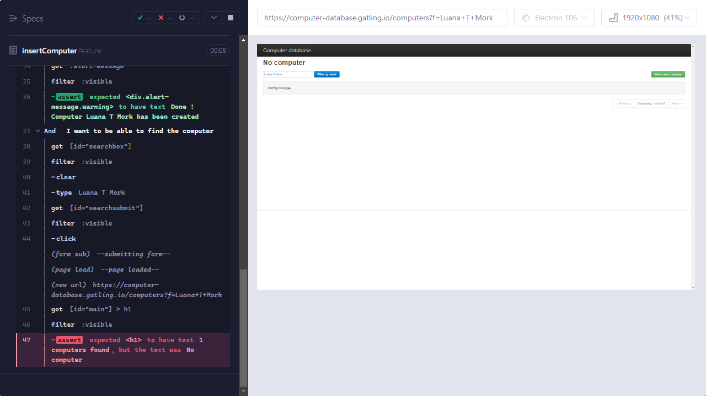

# csc_challenge

The goal is to create an automation project with cypress framework to evaluate my knowledge. This project will be intended to evaluate my performance as part of the selection process for the company CSC(https://www.cscgfm.com/).

>AUTOMATION CHALLENGE

Using Cypress.io, please create test cases for the scenarios listed below using the following test website.
URL: https://computer-database.gatling.io/computers Test Scenarios:
1) Locate the following computer in the table: Commodore 64
    * Click to edit Commodore 64
        * Create a negative test case to ensure a failure validation displays.
        * Create a positive test case to ensure that valid data is updated successfully.
2) Filter computer list by “HP” and create a map of the returned data.
    * Print the map.
3) Filter computer list by “IBM” and return a list of computer names on the LAST page of the
results.
    * Print the list of computer names.
4) Click the ‘Add a new computer’ button, enter some data into the various text fields, select
‘Evans & Sutherland’ from the company dropdown and complete the creation. Verify that the
computer was created successfully.

*Regression Exercise:*

Create regression testing plan to be enacted upon new builds of this system. Describe what would be
tested, how the plan would be maintained, and how it would be integrated with the deployment
pipeline.
```
- The tests were created in BDD to validate the requested scenarios and separated between the functionalities (create, edit and list). This way it is more objective to run only a single test suite or all if necessary.
- The project has a file (.yml) with the necessary steps to run the tests in a pipeline.
```

Provide examples of how the QA team and the suite of regression tests produced by the enactment of
this plan fit into the overarching SDLC.
```
- In this script, I define two Page Objects - one for the homepage and one for the form page. I then use these Page Objects to interact with the elements on the pages and created the scenarios. This helps to keep the code organized and maintainable, and makes it easier to modify the tests if the page structure changes.
```


> Remarks requested

Preferably develop with Javascript language, using cypress framework.

---
## Index

- [Used technologies](#used-technologies)
- [Run test](#run-test)
- [Final Considerations](#final-considerations)
---
## Used technologies 
---
For this challenge, The following technologies were used:
- Javascript
- Cucumber
- cypress
- node
---

## Run tests

To run the project, just go in your favorite terminal to the project directory and execute the following command:

This command installs a package, and any packages that it depends on.
```bash
  $ npm install
```
This command is responsible for running the tests.
```bash
  $ npx cypress open
or
  $ npx cypress run
```
---
## Final Considerations
```
In summary, the challenge was fun, I can apply some techniques in the tests and try to make it as simple as possible. 
I hope I was able to show what was requested.
```
During the automation of the requested scenarios, I noticed that the application did not create new register and also did not persist the updates made. Although the application presents a success message for the actions mentioned above.

It is worth emphasizing that the tests that have two scenarios fail, as I created a validation to ensure that a new register was actually created, as well as the register was updated.

Here a image that after created a new register it's not possible to find by computer name



[Go To TOP](#TOP)


